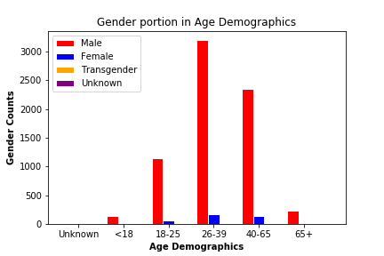
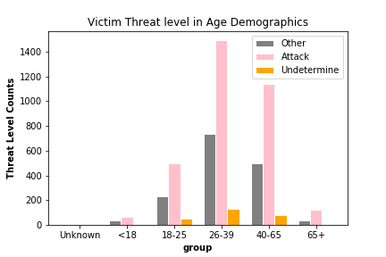
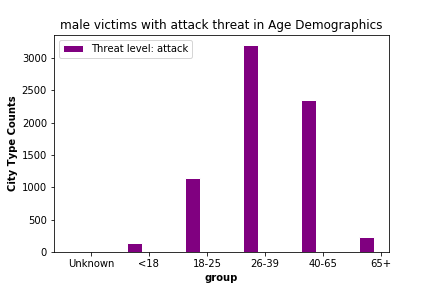
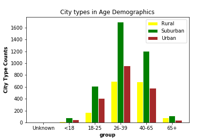
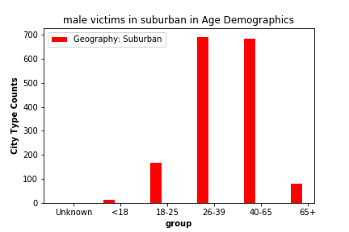

# ProjectOnePolice

Fatal shootings between 2015 and 2020
An analysis is contained fatal shooting by police in each age group- The csv files have not tracked deaths of people in police custody,fatal shootings by off-duty officers or non-shootings deaths.

About the data
The file fatal-police-shootings-data.csv contains data about each of the fatal shootings in csv format and I have break down victims in 6 age group, and filter by gender, violence level and victims rate in city types.

        
 Break down
 (1) divided victims in 6 age group, then calculate total amount of victims by gender
 (2) Determine which gender has the most total victims. As result, male gender take place for the most total victims.
 (3) Calculate the total of victim threat level(Attack, Others, Undetermined) in each group age, attack violence took place in the most victim threat level
 (4) Since we know most victims are come from male gender, we would like to determine the total number of male victims with attack violence, and compare the percentage in total victims and just total victims in male gender
 (5) Calculate the total victims rate in city types (Rural, Suburban, Urban)in each group age, suburban took place for in the city type
 (6) Since we know most victims are come from male gender, we would like to determine the total number of male victims in suburban, and compare the percentage in total victims and just total victims in male gender
        
        
        

Male victimin age group 26-39 is 43.13% in male total, and female victims in age group 26-39 is 20.21% in total victims. Age group 26-39 took the highest victim shooting rate.
          
          

Threat level with attack is 50% higher than others in age group 26-39
          
          

Male victims with threat level:attack, is the highest in age group 26-39, 99% are from male victims
          
          

Suburban has the highest victim fatal porpotion in age group 26-39
          
          

Male victim is the highest in subburban with 94% in male victims
          
          
          
